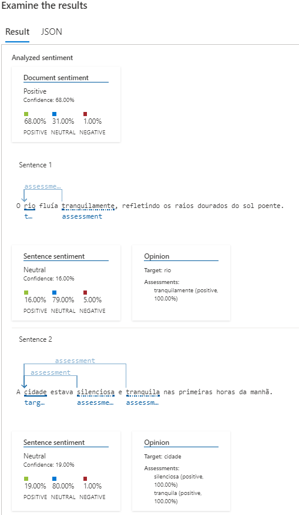
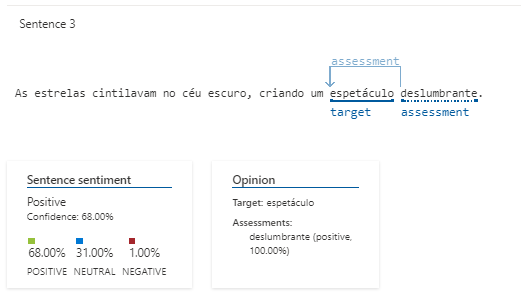
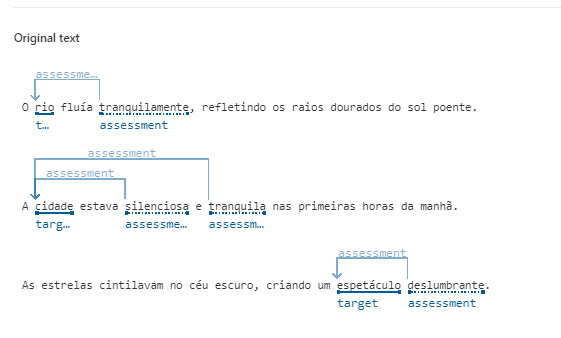

# dio-lab-azure-language
Repositório para o projeto Análise de Sentimentos com Language Studio no Azure AI

# Azure language
É um conjunto de serviços e ferramentas oferecidos para o processamento de linguagem natural (PLN) e tarefas relacionadas. Ele inclui uma variedade de recursos, como análise de texto, tradução automática, reconhecimento de entidades e muito mais.

<br>
<br>

## Análise de Sentimentos com Language Studio no Azure AI
#### INPUT - SENTENÇAS

``` 
1 - O rio fluía tranquilamente, refletindo os raios dourados do sol poente.
2 - A cidade estava silenciosa e tranquila nas primeiras horas da manhã.
3 - As estrelas cintilavam no céu escuro, criando um espetáculo deslumbrante.
```

#### OUTPUT - SENTENÇAS 1 E 2



---


#### OUTPUT - SENTENÇA 3



---


#### OUTPUT - TEXTO ORIGINAL



---